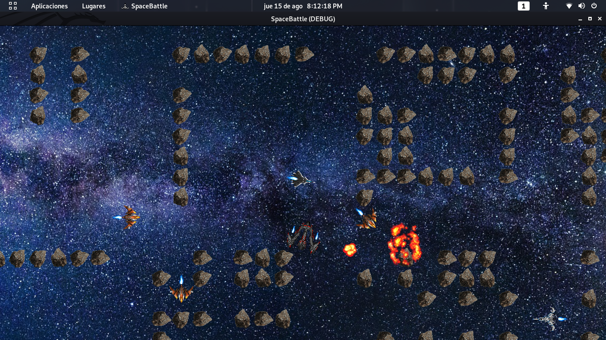

<h1>
Space Battle
</h1>

**Space Battle** es un videojuego donde dos equipos se enfrentan en un terreno con el objetivo de capturar la bandera del equipo contrario. El jugador forma parte de uno de los dos equipos y su objetivo es conseguir la victoria para su equipo. La idea original de este juego vino por parte de un proyecto de Inteligencia Artificial y Simulación, ideado por mí en compañía de mi compañero de cuarto. Debido a que quedamos satisfechos con el camino que estaba tomando el desarrollo de este, así como el nivel que exigía su desarrollo, motivo llevó a la existencia de este documento dada la cantidad de recursos y estrategias utilizadas para este fín.

# Objetivo de este documento

Mostrar el desarrollo desde 0 de un videojuego hecho con **Godot** de manera detallada, usando **GodoScript** puro como lenguaje de programación; mostrar al lector un conjunto de técnicas avanzadas de programción y algoritmos de inteligencia artificial aplicadas a problemas particulares de este videojuego; y proporcionar una alternativa al paradigma orientado a objetos en el marco de GodoScript.

# 
Space Battle

## Detalles del juego
